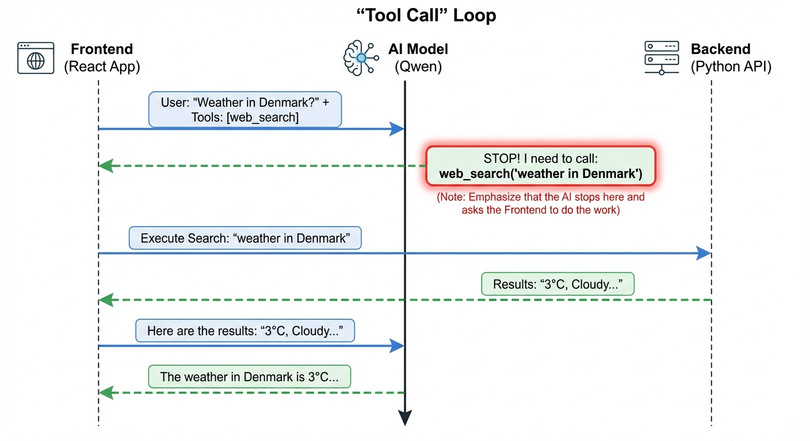

# Web Search Implementation

This document explains how the web search feature works in the DGX Spark Chat application.

## Information Flow Diagram

## How It Works

The search feature uses the "Tool Calling" capability of the Qwen model. Here is the step-by-step process:

1.  **User Request**: The user asks a question (e.g., "What is the weather in Denmark?") with the "Web Search" toggle enabled.
2.  **Tool Definition**: The frontend sends the user's message to the AI model along with a definition of the `web_search` tool.
3.  **Decision**: The AI model analyzes the request and realizes it needs external information. Instead of answering, it returns a **Tool Call Request** (e.g., `web_search(query="weather in Denmark")`).
4.  **Execution**:
    *   The Frontend receives this request.
    *   It calls the Backend API (`/api/search`).
    *   The Backend searches DuckDuckGo and **scrapes the content** of the top results to get detailed information.
5.  **Response**: The Backend returns the enriched search results to the Frontend.
6.  **Final Answer**: The Frontend sends the search results back to the AI model. The AI reads the results and generates the final, natural language answer for the user.

## Technical Components

*   **Frontend (`src/api.ts`)**: Defines the tool structure and handles the loop of sending messages, executing tools, and sending results back.
*   **Backend (`metrics-api.py`)**: Implements the `/api/search` endpoint using `duckduckgo_search` and `BeautifulSoup` for page scraping.
*   **AI Model (Qwen)**: The "brain" that decides when to search and synthesizes the final answer.
